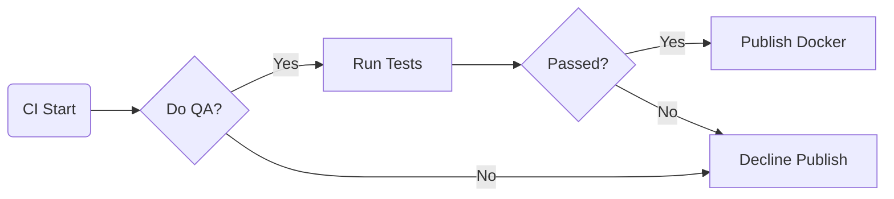
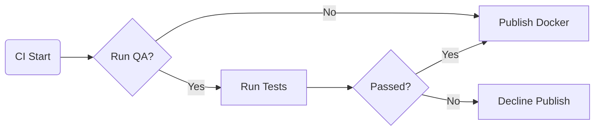

# CI/CD Workflows

[](https://github.com/boromir674/automated-workflows/actions/workflows/cicd.yml)
[](https://automated-workflows.readthedocs.io)
[](https://github.com/boromir674/automated-workflows/blob/main/LICENSE)

`Reusable Workflows` for **CI/CD Pipelines**, implemented as `Github Actions Workflows`.

**Documentation available** at https://automated-workflows.readthedocs.io.

- Source: https://github.com/boromir674/automated-workflows
- CI: https://github.com/boromir674/cicd-test/actions
- Docs: https://automated-workflows.readthedocs.io

## Workflows Overview

- [**Docker**](.github/workflows/docker.yml): Build Docker image and Push to Dockerhub.
- [**PyPI**](.github/workflows/pypi_env.yml): Upload Python distribution to PyPI
- [**Lint**](.github/workflows/lint.yml): Static Code Analysis
- [**Code Visualization**](.github/workflows/python_imports.yml): Visualize Python Code as an `svg` Graph of `Module Imports`

#### Prerequisites


List any prerequisites that users need before using your workflows. For example:

- GitHub account.
- Access to a repository.
- Passing a proper DOCKER_USER from `context`
- Passing a proper DOCKER_PASSWORD from `secrets`

### `Use Case 1: CI/Continuous Deployment`

"We publish to Dockerhub only tested builds"



```yaml
env:
  DO_QA: true

jobs:
  build_n_test:
    runs-on: ubuntu-latest
    if: always() && ${{ env.DO_QA == 'true' }}
    steps:
      - run: echo "Build Code and run Tests"

  call_docker_job:
    needs: build_n_test
    uses: boromir674/automated-workflows/.github/workflows/docker.yml@test
    with:
      DOCKER_USER: ${{ vars.DOCKER_USER }}
      acceptance_policy: 2
      image_slug: "my_app_name"
      image_tag: "1.0.0"
      tests_pass: ${{ needs.build_n_test.result == 'success' }}
      tests_run: ${{ !contains(fromJSON('["skipped", "cancelled"]'), needs.build_n_test.result) }}
    secrets:
      DOCKER_PASSWORD: ${{ secrets.DOCKER_PASSWORD }}
```

### `Use Case 2: CI/Continuous Delivery`

We publish to Dockerhub tested builds.  
Not tested builds (ie when CI Test Job is skipped for any reason), are still treated as eligible for Docker Publish.  
Useful to trigger Docker Job, without waiting for Tests.



```yaml
env:
  DO_QA: false

jobs:
  build_n_test:
    runs-on: ubuntu-latest
    if: always() && ${{ env.DO_QA == 'true' }}
    steps:
      - run: echo "Build Code and run Tests"

  call_docker_job:
    needs: build_n_test
    uses: boromir674/automated-workflows/.github/workflows/docker.yml@test
    with:
      DOCKER_USER: ${{ vars.DOCKER_USER }}
      acceptance_policy: 3
      image_slug: "my_app_name"
      image_tag: "1.0.0"
      tests_pass: ${{ needs.build_n_test.result == 'success' }}
      tests_run: ${{ !contains(fromJSON('["skipped", "cancelled"]'), needs.build_n_test.result) }}
    secrets:
      DOCKER_PASSWORD: ${{ secrets.DOCKER_PASSWORD }}
```

## License

- See the [LICENSE](LICENSE) file to read the License, under which this Project is released under.
- This project is licensed under the [GNU Affero General Public License v3.0](LICENSE).
- Free software: `GNU Affero General Public License v3.0`
