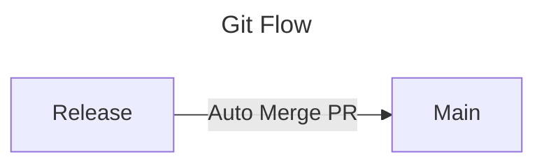
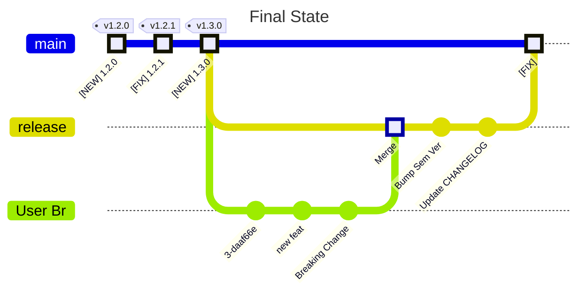

---
tags:
  - how-to
  - guide
---

# Setup Phase 2 of `release-me` Git Ops Process

This is a `how-to` Guide, with everything you need, to setup  
`release-me` *Phase 2* **Git Ops Process**:



## Prerequisites
- a `github repository`
- **Auto Merge** is ON, on Github Repository Settings

## Guide

### 1. Add Workflow that triggers on 'auto-prod-*' tag events

Populate file `.github/workflows/gitops-auto-merge-main.yml` with content:
```yaml
on:
  push:
    tags:
      - auto-prod-*
jobs:
  # please add 'main' Rule Required Checks, before running this job
  auto_merge_main_pr:
    uses: boromir674/automated-workflows/.github/workflows/go-auto-merge-main.yml@fda3c758fa361c49e056977b1aeb0b2be01c99f1  # v1.6.1
    with:
      commit_message: 'My Shiny Software Package'
      # Optional inputs
      main_branch: ${{ vars.GIT_MAIN_BRANCH || 'main' }}
      release_branch: ${{ vars.GIT_RELEASE_BRANCH || 'release' }}
    secrets:
      pat_token: ${{ secrets.GH_TOKEN_PR_RW }}
```

and set the `commit_message` input value to a sensible message for your project case.

### 2. Grant required Permissions to manipulate PRs and trigger Workflows

  1. Create a **PAT**, scoped for your repository, bearing the `read/write` permission for:
     - *Pull Requests*
  2. Make PAT available to your repo as a `Repository Secret`
     1. Create **Repository Secret** with `name` `GH_TOKEN_PR_RW`
     2. Set **Repository Secret** `value` the **PAT**


## Congratulations!

You should have the **required Workflows** for implementing **Phase 2** of the  `release-me` **Git Ops Process**!


### Try out

1. Sync your Release Branch

    ```

        release="release"

        git fetch
        git branch --track $release "origin/${release}" || echo "Found local Branch '${release}'"
        git checkout "${release}"
        git pull origin "${release}"

    ```

2. Optionally, update your Changelog, bump source Sem Ver

3. Fire `auto-prod` event, as in example

    ```

        ap_tag=auto-prod-1.3.0

        git tag -d ${ap_tag} || true
        git push origin -d "${ap_tag}" || true
        git tag "${ap_tag}"
        git push origin "${ap_tag}"

    ```

### Result

**Auto Merge** is enabled on `PR` **'release'** --> **'main'**.

And finally `release` branch **merges** into `main`; reaches **Git State** as below example:


