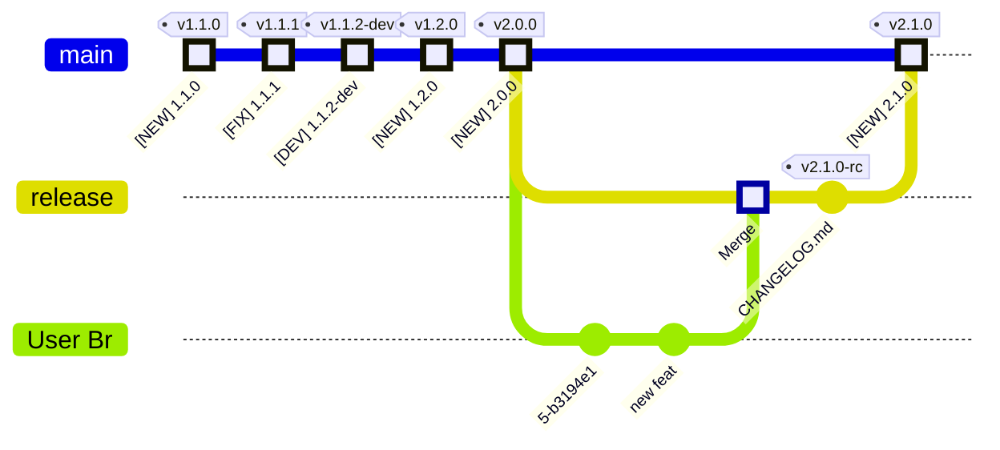

---
tags:
  - how-to
  - guide
---

# Run `release-me` Git Ops Process

This is a `how-to` Guide, with everything you need, to "run" the  
`release-me` process **Git Ops Process**.

## Prerequisites
- Seting Up a Repository
    - [Setup `release-me` - Phase 1](../setup/guide_setup_gitops_release_me.md)
    - [Setup `release-me` - Phase 2](../setup/guide_setup_gitops_release_me_phase_2.md)

- Single branch with all changes, based on `main`

    ```mermaid

      %%{init: { 'logLevel': 'debug', 'gitGraph': {'showBranches': true, 
      'rotateCommitLabel': true,
      'showCommitLabel':true,'mainBranchName': 'main'}} }%%

      gitGraph
          commit id: "[NEW] 1.1.0" type: HIGHLIGHT tag: "v1.1.0"
          commit id: "[FIX] 1.1.1" type: HIGHLIGHT tag: "v1.1.1"
          commit id: "[DEV] 1.1.2-dev" type: HIGHLIGHT tag: "v1.1.2-dev"
          commit id: "[NEW] 1.2.0" type: HIGHLIGHT tag: "v1.2.0"
          commit id: "[NEW] 2.0.0" type: HIGHLIGHT tag: "v2.0.0"
          branch release
          branch "User Br"
          commit
          commit id: "new feat"
    ```

## Recommendations

- Setting Up Recommended Policies
    - [Setup Automatic QA](../setup/guide_setup_main_automated_acceptance.md)
    - [Setup Human Approval](../setup/guide_setup_main_manual_acceptance.md)


## :material-forward: Guide


<!-- <div class="annotate" markdown> -->

1. :octicons-tag-24: Fire-up `release-me` git tag event

    ```sh
    export _tag=release-me
    git tag -d "$_tag"; git push --delete origin "$_tag";
    git tag "$_tag" && git push origin "$_tag"
    ```

2. :material-source-pull: Wait for PR to open against *base* `main` branch, from *head* `release` branch

3. :material-sync: Sync `release` branch to local checkout

    ```sh
    export release=release
    ```

    ```sh
    git fetch
    git branch --track $release "origin/${release}" || true
    git checkout "${release}"
    git pull origin "${release}"
    ```

4. :simple-semanticrelease: Derive Release Semantic Version

    **Please enter** the new **Semantic Release Version**, you intend to publish:

<div class="grid cards" markdown>

-   <input type="text" id="semver-input" placeholder="Input Release Semantic Version; ie 1.2.1" oninput="updateSemVer()">

    ---

    Input Release Semantic Version; ie 1.2.1

    - Get help in **determining Version Bump**, from the [:material-arrow-decision: Decision Diagram](../../../topics/semantic-release.md#semantic-release-version-bump)
    - Read more on [:octicons-book-16: Semantic Release Topic](../../../topics/semantic-release.md)


-   :material-clock-fast:{ .lg .middle } __Automation currently supports__

    ---

    - `<M.m.p>` for Public Changes

        Eg: `1.0.0`, `1.2.1`, `0.5.0`

    - `<M.m.p-dev\d?\>` for Private Changes

        Eg: `1.0.1-dev`, `1.2.1-dev2`,  
        `0.5.0-dev1`

</div>

<div class="annotate" markdown>

<ol start="5">
    <li>Update Changelog (1)<pre><code>code CHANGELOG.md</pre></code><pre><code class="language-sh"><span id="semver-output2">git add CHANGELOG.md && git commit -m "chore(changelog): add v... Changelog Release Entry"</span></pre></code><pre><code>git push origin release</pre></code></li>
    <li>If you maintain the Sem Ver in your source files, <strong>update Sem Ver in sources (2)</strong></li>
    <li>Fire-up an <code>auto-prod-&lt;sem ver&gt;</code> git tag event (ie <code>auto-prod-1.2.0</code>)

        <pre><code class="language-sh"><span id="semver-output">export _SEM_VER=...</span></code></pre>

        ```sh
        export _tag="auto-prod-${_SEM_VER}"
        git tag -d "$_tag"; git push --delete origin "$_tag";
        git tag "$_tag" && git push origin "$_tag"
        ```

    </li>
    <li>If, you have setup <code>Human Approval</code>, give the Release a <strong>green light</strong>, by approving a Code Review.</li>
</ol>

<script> function updateSemVer() { var input = document.getElementById('semver-input').value; document.getElementById('semver-output').innerText = 'export _SEM_VER=' + input; document.getElementById('semver-output2').innerHTML = 'git add CHANGELOG.md && commit -m "chore(changelog): add v' + input + ' Changelog Release Entry"'; } </script>

</div>

1.  :man_raising_hand: Typically the CHANGELOG.md file!

2.  :man_raising_hand: Typical files are, `VERSION`, `pyproject.toml`, `package.json`, etc.

## Congratulations :partying_face:

Your changes should now be **merged** and **tagged** into `main`!



### Next Steps

- :material-sync: Sync your local `main` branch with **remote**

    ```sh
    git checkout main && git pull origin main
    ```
