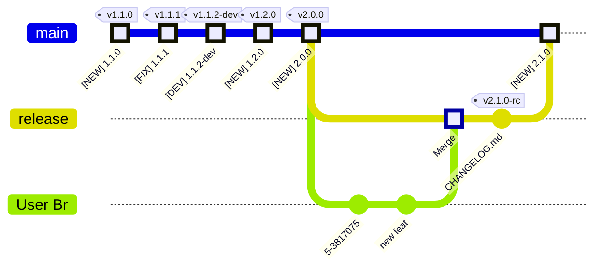

---
tags:
  - how-to
  - guide
---

# Run `release-me` Git Ops Process

This is a `how-to` Guide, with everything you need, to "run" the  
`release-me` process **Git Ops Process**.

## Prerequisites
- Seting Up a Repository
    - [Setup `release-me` - Phase 1](../setup/guide_setup_gitops_release_me.md)
    - [Setup `release-me` - Phase 2](../setup/guide_setup_gitops_release_me_phase_2.md)

- Single branch with all changes, based on `main`

    ```mermaid

      %%{init: { 'logLevel': 'debug', 'gitGraph': {'showBranches': true, 
      'rotateCommitLabel': true,
      'showCommitLabel':true,'mainBranchName': 'main'}} }%%

      gitGraph
          commit id: "[NEW] 1.1.0" type: HIGHLIGHT tag: "v1.1.0"
          commit id: "[FIX] 1.1.1" type: HIGHLIGHT tag: "v1.1.1"
          commit id: "[DEV] 1.1.2-dev" type: HIGHLIGHT tag: "v1.1.2-dev"
          commit id: "[NEW] 1.2.0" type: HIGHLIGHT tag: "v1.2.0"
          commit id: "[NEW] 2.0.0" type: HIGHLIGHT tag: "v2.0.0"
          branch release
          branch "User Br"
          commit
          commit id: "new feat"
    ```

## Recommendations

- Setting Up Recommended Policies
    - [Setup Automatic QA](../setup/guide_setup_main_automated_acceptance.md)
    - [Setup Human Approval](../setup/guide_setup_main_manual_acceptance.md)


## Guide


<div class="annotate" markdown>

1. Fire-up `release-me` git tag event

    ```sh
    export _tag=release-me
    git tag -d "$_tag"; git push --delete origin "$_tag";
    git tag "$_tag" && git push origin "$_tag"
    ```

2. Wait for PR to open against *base* `main` branch, from *head* `release` branch

3. Sync `release` branch to local checkout

    ```sh
    export release=release
    ```

    ```sh
    git fetch
    git branch --track $release "origin/${release}" || true
    git checkout "${release}"
    git pull origin "${release}"
    ```

4. Derive new Sem Ver

    

    Please enter the new **Semantic Release Version**, you intend to publish:

    <input type="text" id="semver-input" placeholder="Enter new semver" oninput="updateSemVer()">


5. Update Changelog (1)

6. If you maintain the Sem Ver in your source files, **update Sem Ver in sources**

7. Fire-up a `auto-prod-<sem ver>` git tag event (ie `auto-prod-1.2.0`)

    <pre><code class="language-sh"><span id="semver-output">export _SEM_VER=...</span></code></pre>

    <!-- export _SEM_VER=<span id="semver-output">...</span> -->

    ```sh
    export _tag="auto-prod-${_SEM_VER}"
    git tag -d "$_tag"; git push --delete origin "$_tag";
    git tag "$_tag" && git push origin "$_tag"
    ```

<script> function updateSemVer() { var input = document.getElementById('semver-input').value; document.getElementById('semver-output').innerText = 'export _SEM_VER=' + input; } </script>

1. If, you have setup `Human Approval`, give the Release a **green light**, by approving a Code Review.

</div>

1.  :man_raising_hand: Typically the CHANGELOG.md file!

## Congratulations :partying_face: !

Your changes should now be merged into `main`.


