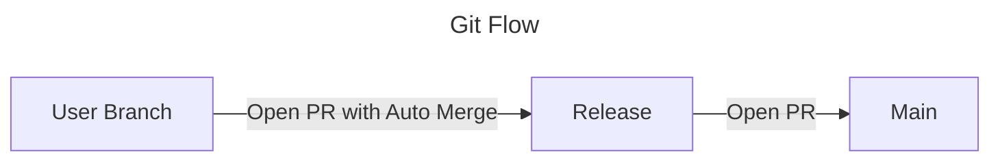
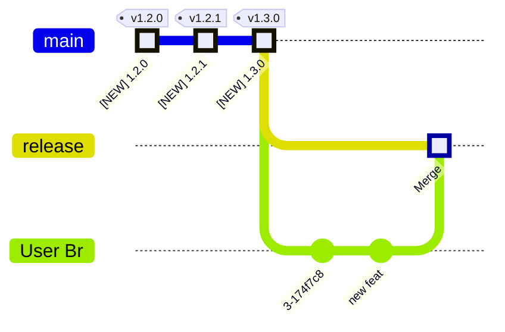

---
tags:
  - how-to
  - guide
---

# Setup Phase 1 of `release-me` Git Ops Process

This is a `how-to` Guide, with everything you need, to setup  
`release-me` *Phase 1* **Git Ops Process**:



For more on *Phase 1* of this **Git Ops Process**, see the [*Release Me Phase 1* Topics Page](../../../topics/gitops/release-me-process.md).


## Prerequisites
- a `github repository`
- **Auto Merge** is ON, on Github Repository Settings

## Guide

### 1. Add Workflow that triggers on `release-me` git tag events

Populate file `.github/workflows/gitops-pr-to-release.yml` with content:

```yaml
on:
  push:
    tags:
      - release-me  # Request to be included in next Release and create a Release
jobs:
  pr_to_release:
    uses: boromir674/automated-workflows/.github/workflows/go-pr-to-release.yml@fda3c758fa361c49e056977b1aeb0b2be01c99f1  # v1.6.1
    with:
      release_branch: ${{ "{{" }} vars.GIT_RELEASE_BRANCH || 'release' {{ "}}" }}
    secrets:
      github_pat: ${{ "{{" }} secrets.PR_RW_AND_ACTIONS_RW {{ "}}" }}
```

to automatically open **PR to release**, when `release-me` git tag events happen.


### 2. Add Workflow that opens PR into main, when Git Ops PR merges to release

Populate file `.github/workflows/gitops-pr-to-main.yml` with content:

```yaml
on:
  pull_request:
    types: [closed]
    branches:  # ALLOWED Base Branches
      - release

jobs:
  open_pr_to_main:
    if: github.event.pull_request.merged == true && (
      startsWith(github.event.pull_request.title, '[GITOPS]')
      )
    uses: boromir674/automated-workflows/.github/workflows/go-pr-to-main.yml@fda3c758fa361c49e056977b1aeb0b2be01c99f1  # v1.6.1
    with:
      main_branch: ${{ "{{" }} vars.GIT_MAIN_BRANCH || 'main' {{ "}}" }}
      release_branch: ${{ "{{" }} vars.GIT_RELEASE_BRANCH || 'release' {{ "}}" }}
    secrets:
      PR_RW_AND_ACTIONS_RW: '${{ "{{" }} secrets.PR_RW_AND_ACTIONS_RW {{ "}}" }}'
```

to automatically open **PR to main**, when events satisfying all below conditions, happen:
- PR merged to `release`
- PR title starts with '[GITOPS]' string


### 3. Grant required Permissions to manipulate PRs and trigger Workflows

  1. Create a **PAT**, scoped for your repository, bearing the `read/write` permission for:
     - *Pull Requests*
     - *Actions*
  2. Make PAT available to your repo as a `Repository Secret`
     1. Create **Repository Secret** with `name` `PR_RW_AND_ACTIONS_RW`
     2. Set **Repository Secret** `value` the **PAT**


## Congratulations!

You should have the **required Workflows** for implementing **Phase 1** of the  `release-me` **Git Ops Process**!

### Try out

1. Make some changes

    ```
    git checkout -b my-temp-branch main
    echo 'some changes' >> del.txt
    git add del.txt
    git commit -m "emphemeral: test Git Ops Release Process"
    git push origin -u my-temp-branch
    ```

2. Fire `release-me` event

    ```
    git tag -d release-me || true
    git push origin -d release-me || true
    git tag release-me
    git push origin release-me
    ```

### Result

Open `PR` 'User Br' --> 'release', and merge if *PR OK*



Open `PR` 'release' --> 'main'
