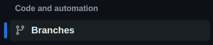
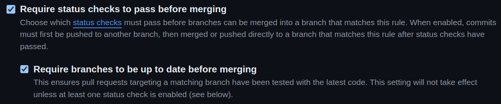
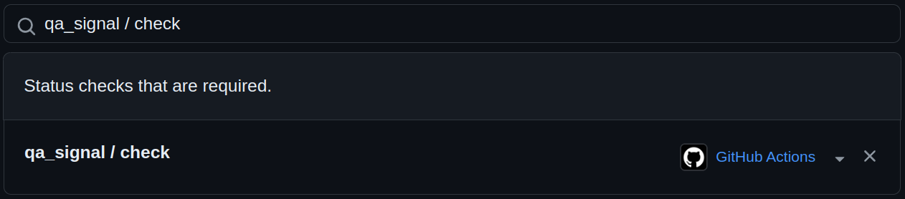

---
tags:
  - how-to
  - guide
---

# Protect `main` Branch, with Automated QA

This is a `how-to` Guide, with everything you need, to "protect" your  
`main` branch, involved in `release-me` *Phase 2* **Git Ops Process**.

## Prerequisites
- a `github repository`
- account with permission to **Repository Settings**

## Guide
[//]: # (This is a comment)

[//]: # (Go to 'Repositoty Settings' --> 'Branch Rules')

<html lang="en">
<head>
  <meta charset="UTF-8">
  <meta name="viewport" content="width=device-width, initial-scale=1.0">
  
  </head>
</html>

1. Navigate to  in your `Repository Settings` on github.com

    

2. Click `branches` under `Code and Automation`

    

3. Ensure there is `Rule` that matches the `main` name pattern

4. Allow code merges in `main` only via PR

    [//]: # (Require PR)
    

5. Allow merges in `main` only if latest commit (of head Branch) passed QA on CI

    1. Require (CI) Status Check on most recent commit

        [//]: # (Require status checks to pass before merging)
        [//]: # (AND Require branches to be up to date before merging)
        

    2. Wire-up your CI Checks into `Single QA Job`, to model `Acceptance`, with a  logical `QA` signal

        !!! Tip

            Typical CI Jobs `Unit Tests`, `Integration Tests`, `automated QA`, `Static Code Analysis`, `e2e`, `Functional Tests`

        Add in your **CI/CD Workflow** the `Single Status` Job. See examples below:

        [//]: # (4 tabs of example configurations for common CI/CD Pipelines)
        

        !!! Tip

            Shrinks the interfacing surface beween `Git Ops Acceptance` and your `CI/CD` Pipeline

    3. Include the `Single QA Job` in the `Required Status Checks` the Wire-up your CI Checks into Single QA Job

        [//]: # (qa singal Job added in the required status checks list)
        

## Congratulations!

You should now have `protected` your `main` branch according to **Git Ops**!
