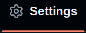
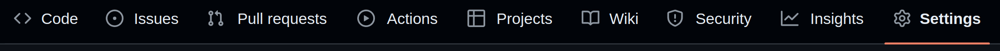
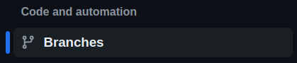
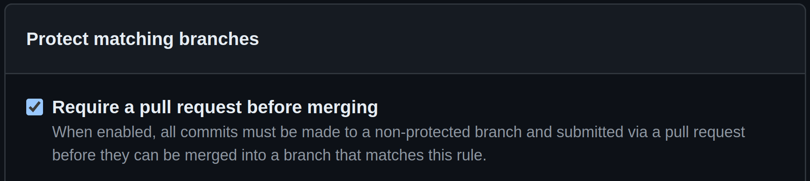
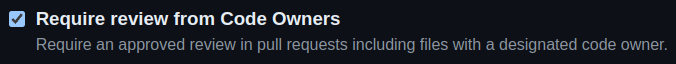

---
tags:
  - how-to
  - guide
---

# Protect `main` Branch, with Manual QA

This is a `how-to` Guide, with everything you need, to "protect" your  
`main` branch with **Manual Checks**.  
The Guide is part of the `release-me` *Phase 2* **Git Ops Process**.

## Prerequisites
- a `github repository`
- account with permission to **Repository Settings**

## Guide

[//]: # (Go to 'Repositoty Settings' --> 'Branch Rules')

<html lang="en">
<head>
  <meta charset="UTF-8">
  <meta name="viewport" content="width=device-width, initial-scale=1.0">
  
  </head>
</html>

1. Navigate to  in your `Repository Settings` on github.com

    

2. Click `branches` under `Code and Automation`

    

3. If no `Rule` exists that matches the `main` name pattern, create one

3. If PR is NOT required before merging, enable the rule to allow code merges in `main` **only via PR**

    [//]: # (Require PR)
    

4. Require Manual Approval, using self `code review`

    

## Congratulations!

You should now have ensured no merge happens to `main` branch, without manual intervention!
