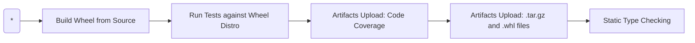

# How to setup Python CI

**Setup CI**, for `Testing Python Distribution`.

sse the `test_build.yml` Reusable Workflow

### 1. Create a Github Repository

### 2. Create a Python Package

- `pyproject.toml` or `setup.py` *supported*

### 3. Edit your Github Actions workflow file

Add the following `Job` into your `workflow config` yaml file, under the `jobs` document key:

```yaml
jobs:
  test:
    uses: boromir674/automated-workflows/.github/workflows/test_build.yml@test
    with:
      build_installation: 'wheel'
      job_matrix: "{\"platform\": [\"ubuntu-latest\"], \"python-version\": [\"3.11\"]}"
```

Now, you are set and done!

Commit, push your code, and trigger "your workflow" on Github Actins.

## What to expect


