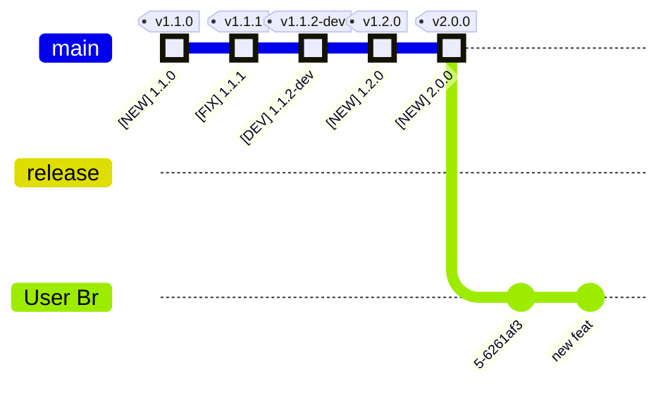

```mermaid

    %%{init: { 'logLevel': 'debug', 'gitGraph': {'showBranches': true, 
    'rotateCommitLabel': true,
    'showCommitLabel':true,'mainBranchName': 'main'}} }%%

    gitGraph
        commit id: "[NEW] 1.1.0" type: HIGHLIGHT tag: "v1.1.0"
        commit id: "[FIX] 1.1.1" type: HIGHLIGHT tag: "v1.1.1"
        commit id: "[DEV] 1.1.2-dev" type: HIGHLIGHT tag: "v1.1.2-dev"
        commit id: "[NEW] 1.2.0" type: HIGHLIGHT tag: "v1.2.0"
        commit id: "[NEW] 2.0.0" type: HIGHLIGHT tag: "v2.0.0"
        branch release
        branch "User Br"
        commit
        commit id: "new feat"
```
