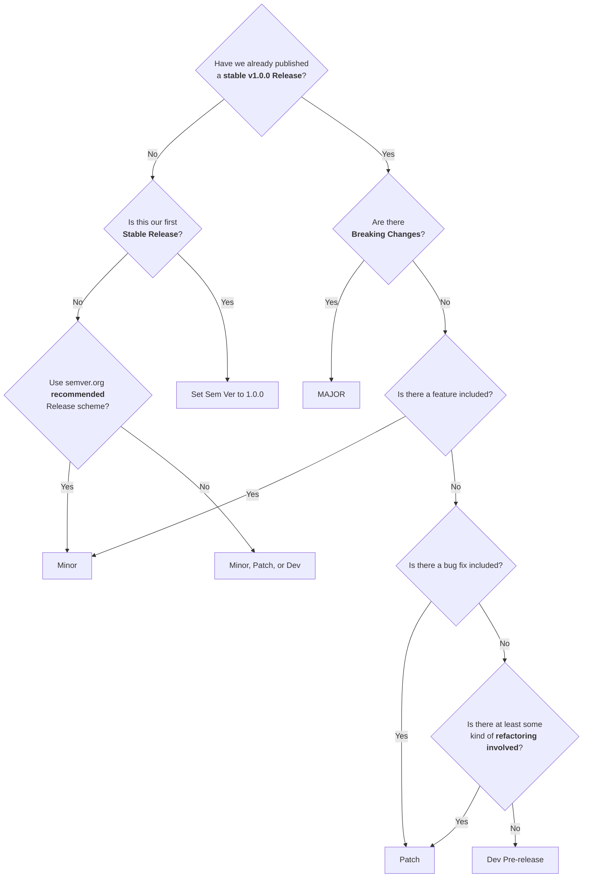

[//]: # (Semantic Version Bump/Version Derivation Process)

```mermaid

graph TD

%% START((START))

COND_HAS_STARTED_SEMVER_PROMISE{"`Have we already published
a **stable v1.0.0 Release**?`"}

COND_ARE_THERE_BREAKING_CHANGES{"`Are there
**Breaking Changes**?`"}

COND_INCLUDES_FEATURE{"`Is there a feature included?`"}
COND_INCLUDES_BUGFIX{"`Is there a bug fix included?`"}

%% Does the changes touch the Public API at least ?
COND_INCLUDES_REFACTORING{"`Is there at least some
kind of **refactoring involved**?`"}

COND_IS_THIS_OUR_FIRST_STABLE_RELEASE{"`Is this our first
**Stable Release**?`"}

COND_USE_SEMVER_RECOMMENDED_PRE_STABLE_DEV_CYCLE{"`Use semver.org **recommended**
Release scheme?`"}

SEM_VER_SET_TO_1_0_0[Set Sem Ver to 1.0.0]
POSSIBLE_BUMPS_MAJOR[MAJOR]
POSSIBLE_BUMPS_MINOR[Minor]
POSSIBLE_BUMPS_PATCH[Patch]
POSSIBLE_BUMPS_PRERELEASE[Dev Pre-release]

POSSIBLE_BUMPS_MI_PA_DEV[Minor, Patch, or Dev]

%%%% LOGIC FLOW CHART %%%%
%% START --> COND_HAS_STARTED_SEMVER_PROMISE

%% PATH 1: Stable RELEASE v1.0.0 NOT Published yet

COND_HAS_STARTED_SEMVER_PROMISE -->|No| COND_IS_THIS_OUR_FIRST_STABLE_RELEASE

COND_IS_THIS_OUR_FIRST_STABLE_RELEASE -->|No| COND_USE_SEMVER_RECOMMENDED_PRE_STABLE_DEV_CYCLE
COND_USE_SEMVER_RECOMMENDED_PRE_STABLE_DEV_CYCLE -->|Yes| POSSIBLE_BUMPS_MINOR
COND_USE_SEMVER_RECOMMENDED_PRE_STABLE_DEV_CYCLE -->|No| POSSIBLE_BUMPS_MI_PA_DEV
COND_IS_THIS_OUR_FIRST_STABLE_RELEASE -->|Yes| SEM_VER_SET_TO_1_0_0


%% PATH 2: Stable RELEASE v1.0.0 already Published

COND_HAS_STARTED_SEMVER_PROMISE -->|Yes| COND_ARE_THERE_BREAKING_CHANGES

COND_ARE_THERE_BREAKING_CHANGES -->|Yes| POSSIBLE_BUMPS_MAJOR

COND_ARE_THERE_BREAKING_CHANGES -->|No| COND_INCLUDES_FEATURE

COND_INCLUDES_FEATURE -->|Yes| POSSIBLE_BUMPS_MINOR
COND_INCLUDES_FEATURE -->|No| COND_INCLUDES_BUGFIX

COND_INCLUDES_BUGFIX -->|Yes| POSSIBLE_BUMPS_PATCH

COND_INCLUDES_BUGFIX -->|No| COND_INCLUDES_REFACTORING

COND_INCLUDES_REFACTORING -->|Yes| POSSIBLE_BUMPS_PATCH
COND_INCLUDES_REFACTORING -->|No| POSSIBLE_BUMPS_PRERELEASE

```
