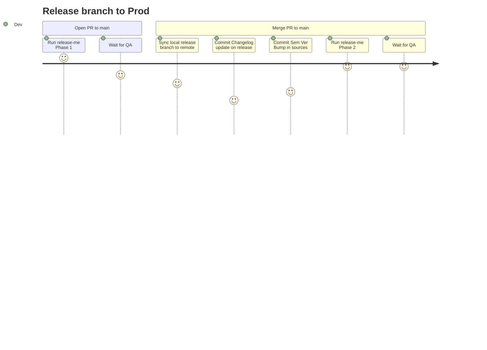

[//]: # (User Journey for release-me Git Ops Process - Mermaid DiagramRequire)

[//]: # (Task name: <score>: <comma separated list of actors>)

```mermaid
journey
    title Release branch to Prod
    section Open PR to main
      Run release-me Phase 1: 9: Dev
      Wait for QA: 7: Dev
    section Merge PR to main
      Sync local release branch to remote: 6: Dev
      Commit Changelog update on release: 4: Dev
      Commit Sem Ver Bump in sources: 5: Dev
      Run release-me Phase 2: 8: Dev
      Wait for QA: 8: Dev
```
