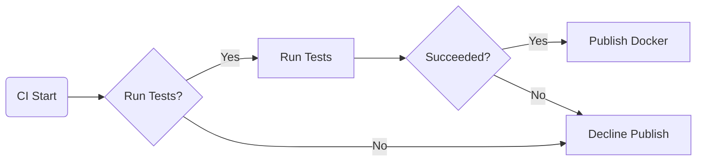
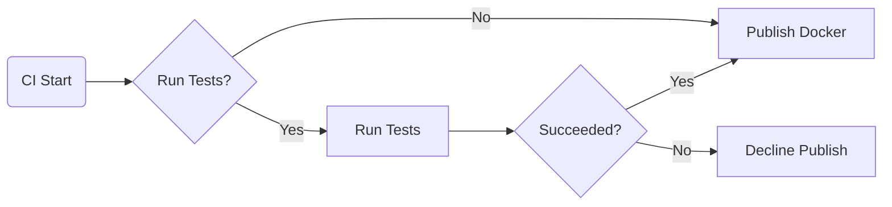

# Automated Workflows

Implement `CI/CD` and `Git Ops`, with `Github Actions Reusable Workflows`.

[](https://github.com/boromir674/automated-workflows/actions/workflows/cicd.yml)

- Features a dedicated **Automated Test Suite** implemented in a separate [`cicd-test`](https://github.com/boromir674/cicd-test) Github Repo.
- **CI** checks out the `Test Suite`, and runs Test Scenarios against the `Reusable Workflows`

## Quick-start

`Case 1: CI/Continuous Deployment`

"We publish to Dockerhub only tested builds"



```yaml

jobs:
  build_n_test:
    runs-on: ubuntu-latest
    steps:
      - run: echo "Build Code and run Tests"

  call_docker_job:
    needs: build_n_test
    uses: boromir674/automated-workflows/.github/workflows/docker.yml@test
    with:
      DOCKER_USER: ${{ vars.DOCKER_USER }}
      acceptance_policy: 2
      image_slug: "my_app_name"
      image_tag: "1.0.0"
      tests_pass: ${{ needs.build_n_test.result == 'success' }}
      tests_run: ${{ !contains(fromJSON('["skipped", "cancelled"]'), needs.build_n_test.result) }}
    secrets:
      DOCKER_PASSWORD: ${{ secrets.DOCKER_PASSWORD }}
```

`Case 2: CI/Continuous Delivery`

We publish to Dockerhub tested builds.  
Not tested builds (ie when CI Test Job is skipped for any reason), are still treated as eligible for Docker Publish.  
Useful to trigger Docker Job, without waiting for Tests.



```yaml

jobs:

    build_n_test:
      runs-on: ubuntu-latest
      steps:
        - run: echo "Build Code and run Tests"

    call_docker_job:
      needs: build_n_test
      uses: boromir674/automated-workflows/.github/workflows/docker.yml@test
      with:
        DOCKER_USER: ${{ vars.DOCKER_USER }}
        acceptance_policy: 3
        image_slug: "my_app_name"
        image_tag: "1.0.0"
        tests_pass: ${{ needs.build_n_test.result == 'success' }}
        tests_run: ${{ !contains(fromJSON('["skipped", "cancelled"]'), needs.build_n_test.result) }}
      secrets:
        DOCKER_PASSWORD: ${{ secrets.DOCKER_PASSWORD }}
```
