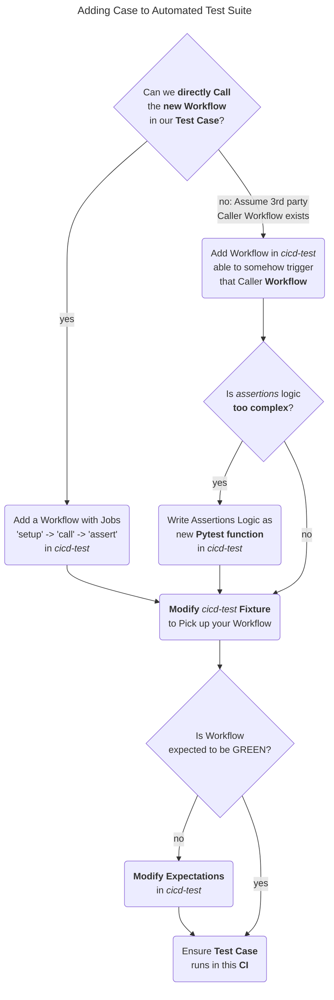

# Writing Test Case for new Worklfow

In general, a Test Case is a set of `GIVEN`, `WHEN`, and `THEN` steps, which involve
some **Client Code** that runs the *Code Under Test*

In Workflow (Unit) Testing, the Client code should be another (caller/consumer) Workflow.  

There are 2 ways for implementing a Test Case in our Test Suite:

- Running Reusable Workflow in a **Test Case** that is a `Caller Workflow`
  - with GIVENs, WHENs, THENs, and the Client Code being a Job that directly calls Resuable Workflow
- Running Reusable Workflow indirectly, in a **Test Case** that triggers `Caller Workflow`
  - with GIVENs, WHENs, THENs, and the Client Code being a 3rd-party `Caller Workflow`

## Development Notes

At our public API surface, we offer Reusable Workflows.

When we want to release a new **Reusable Workflow**, we should implement at least 1 new
Test Case to "cover" it.

This implies creating a new `Test Case Workflow` in one of below **forms**:
- as a `Caller Workflow` of the new **Reusable Workflow**
- as a `Workflow triggering` indirectly a 3rd-party `Caller Workflow`

### Picking up Test Case Form

Here you will find a **Flow Chart** documenting the *process* of creating a `New Test Case`

