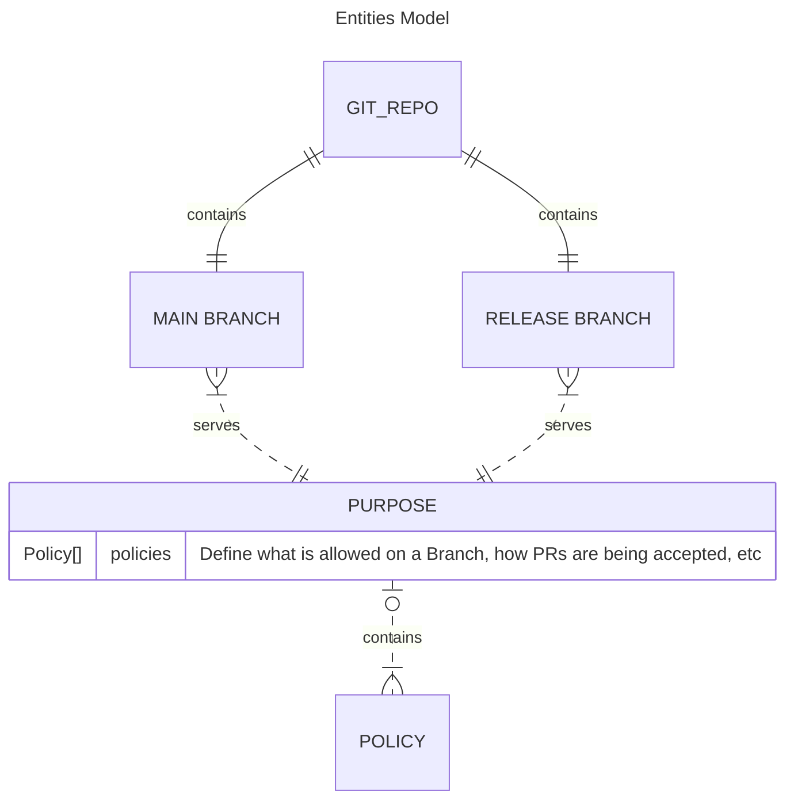
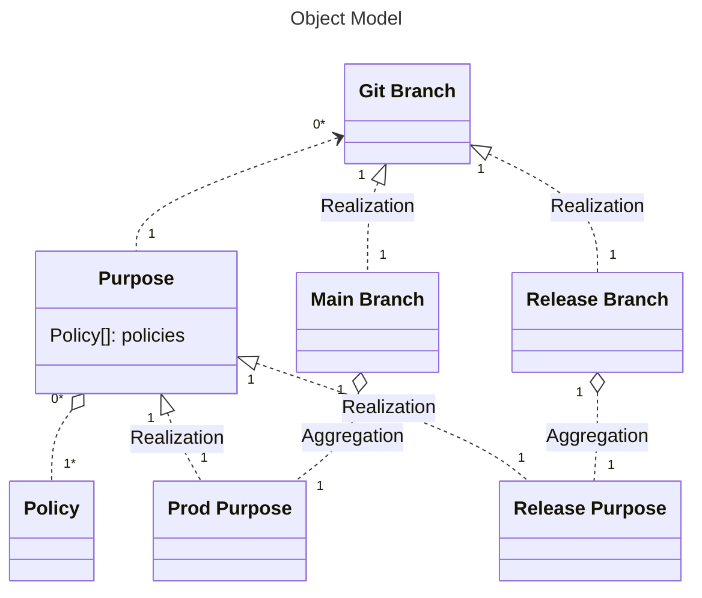

# Git Ops

This document describes our definition of **`Git Ops`** process and introduces what `Automated Workflows` offer to help you implement `Git Ops`.

> **Git Ops** (`GO` or `go`), in the context of a `Software Development`, is a *practice* where Operations, such as opening a PR, merging code, triggering the CI, checking CI status, etc are **automated** using `git events`.

We offer `Resuable Workflows` as building blocks to help you implement `Git Ops`, according to our model.

> As **Git Ops Process**, we define a (semi) automated protocol, that aims to perform one or more of those (git) Operations (see above).

Notable, **Git Ops Processes** are:
| alias | Description | Example Cases |
| ----- | ----------- | -- |
| `release-me` | Release Head into Prod, with 2 PRs: `User Br --> release --> main`  | On a single developer projects |
| `board-train` | Integrate Head into Train: `User Br --> train` | On multi-developer projects |

## Git Ops Processes - Automated

We offer below solutions to help you implement concrete **`Git Ops Processes`**:

- Process [`release-me`](./release-me-process.md)

## Entities Model

## Object Model

