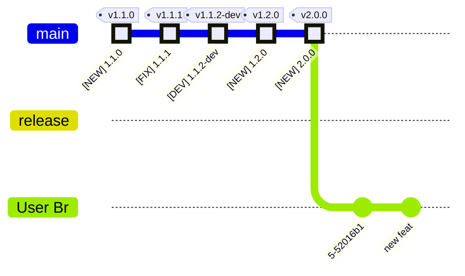

# `release-me` - Git Ops Process

This document describes our definition of the **`release-me`** Git Ops Process.

> **release-me** process ships changes in the `head` branch into Production.

## Branches/PRs flow

## Starting State

## Phase 1

1. Open `PR` 'User Br' --> 'release', and merge if *PR OK*
2. Open `PR` 'release' --> 'main'

## Phase 2

1. Auto Merge `PR` 'release' --> 'main', and merge if *PR OK*

