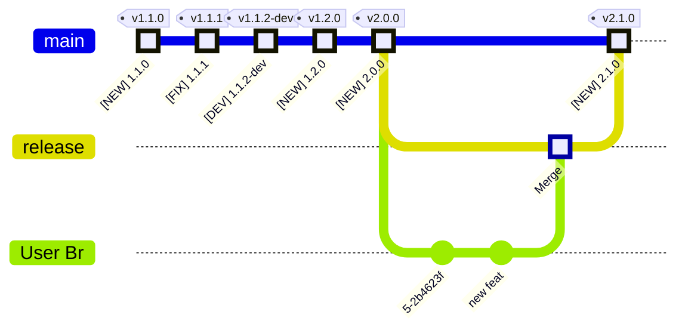

# `release-me` - Git Ops Process

This document describes our definition of the **`release-me`** Git Ops Process.

> **release-me** process ships changes in the `head` branch into Production.

It is designed to suit `starting state` as below



## Phases - Git Flow

The **release-me** process is implemented in 2 Phases.  
Developer fires 2 `git tag` events, one per Phase, to start it, on-demand.


> **`Phase 1` -> Push the `release-me` git tag to remote**

> **`Phase 2` -> Push a `auto-prod-<sem_ver>` git tag to remote**


A typical **Release** `User Journey` for a single-Developer/Contributor project, might look like 

    


## Phase 1

**On-demand trigger** by pushing the `release-me` git tag to remote.

```
export tt='release-me'
git tag -d "$tt"; git push --delete origin "$tt"
git tag "$tt" && git push origin "$tt"
```

1. Open `PR` 'User Br' --> 'release', and merge if *PR OK*
2. Open `PR` 'release' --> 'main'


## Phase 2

**On-demand trigger** by pushing a `auto-prod-<sem_ver>` git tag to remote.

Example:
```
export tt='auto-prod-2.1.0'
git tag -d "$tt"; git push --delete origin "$tt"
git tag "$tt" && git push origin "$tt"
```

1. Auto Merge `PR` 'release' --> 'main', and merge if *PR OK*

