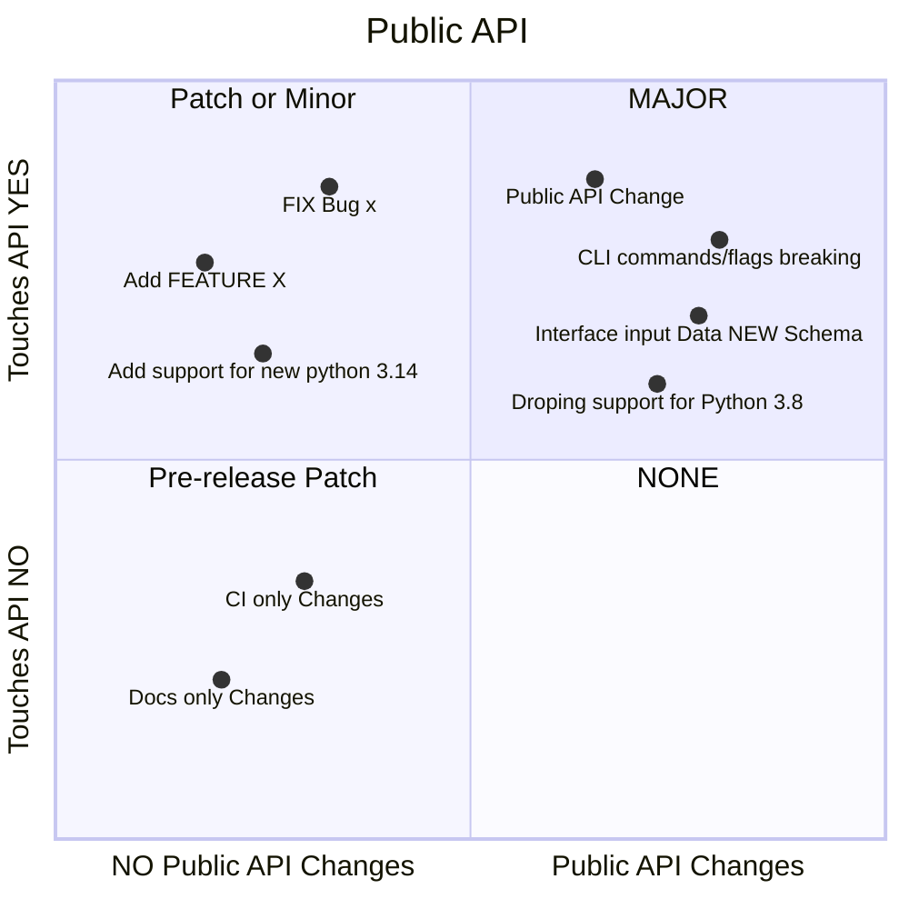

# Sem Ver - Releases

## Semantic Release - Version Bump
> Decide on `Sem Ver Bump` Operator.



## Non-Public API Changes
> Essentially anything that is backwords-compatible.  
> Any non-breaking changes.

- **New** `Features`, ie

    - adding a new CLI flag
    - adding support for new python 3.99 version (in backwords-compatible way)
    - adding support for "switching between different implementations"

- **New** `fixes`, ie

    - fixing a bug (in backwords-compatible way)
    - fixing input DATA parsing
