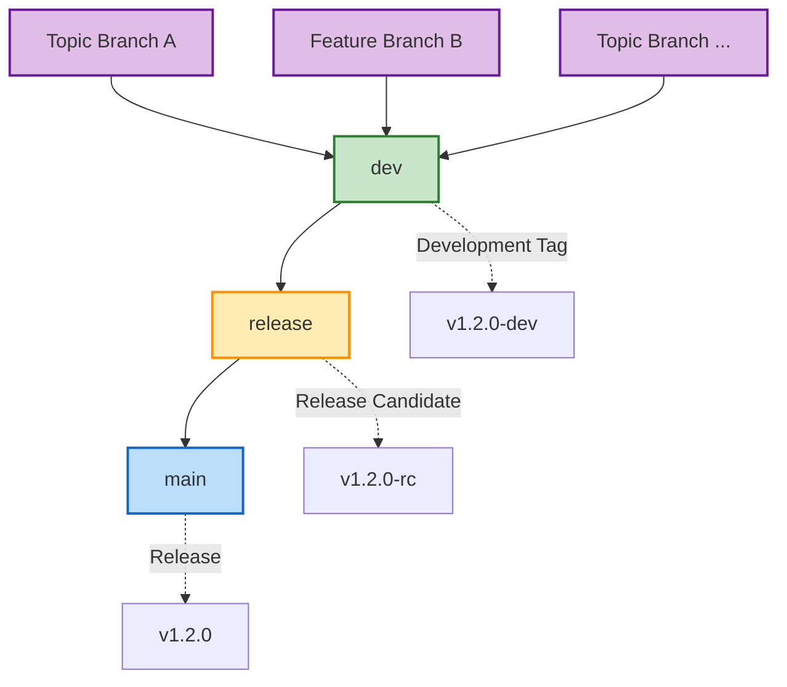
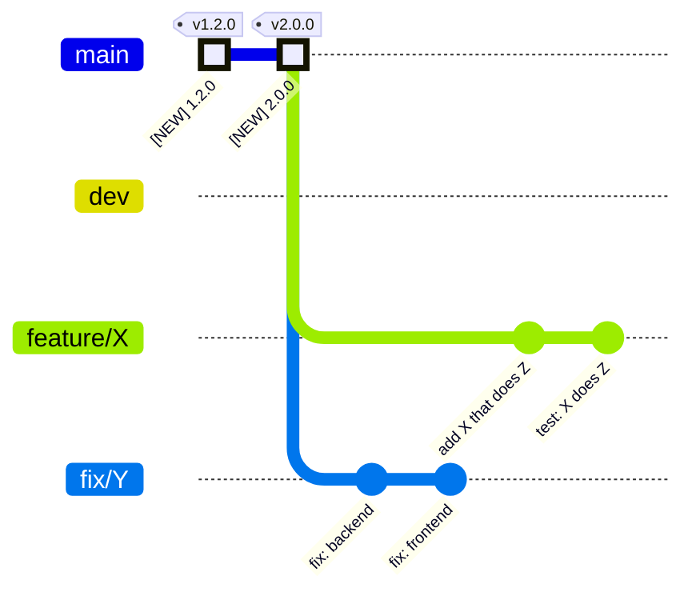
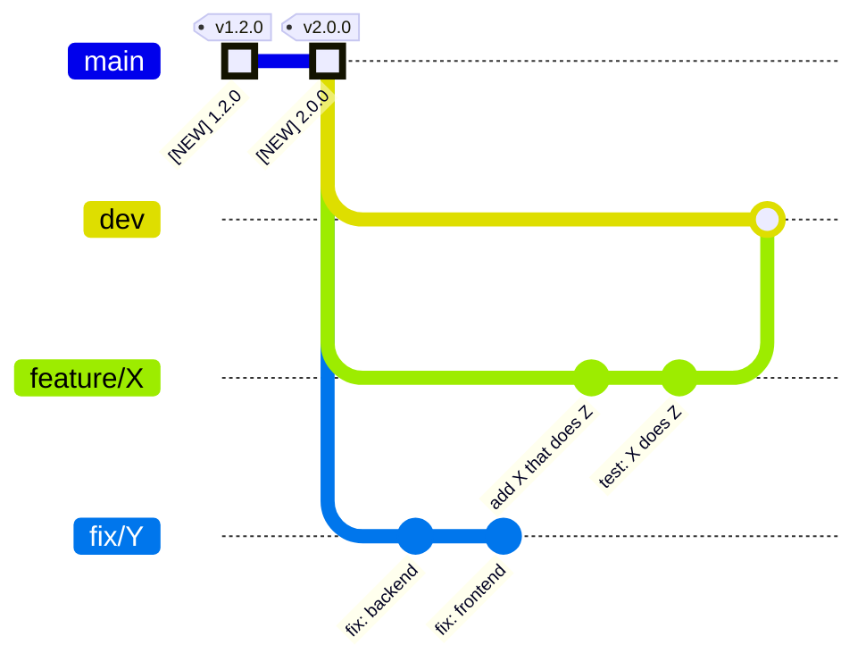
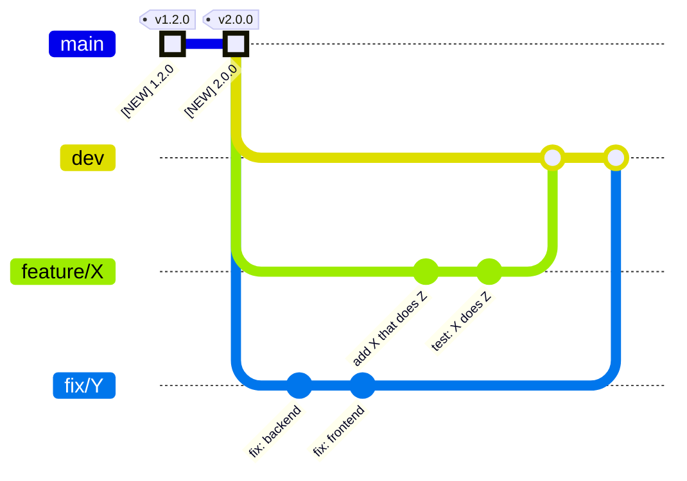
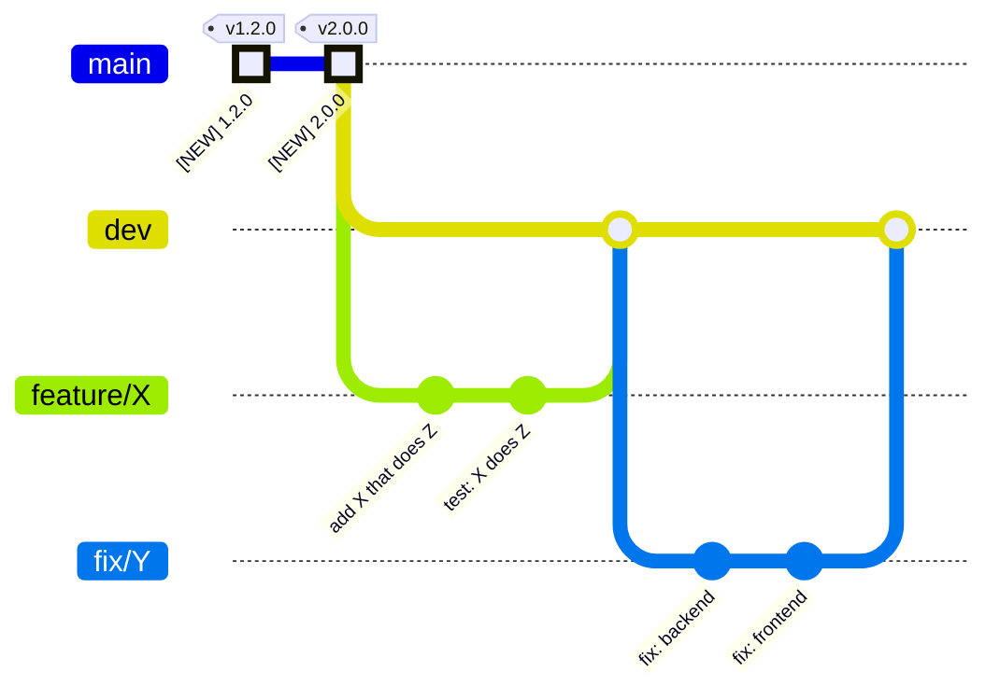

---
tags:
  - tutorial
  - branching
  - git
---

# Branch Model Tutorial

Welcome to the **Branch Model Tutorial**! This document is designed to help you learn the concepts and practices of the branch model used in Git workflows. By the end of this tutorial, you will understand the roles of different branches, their flow, and how they integrate with CI/CD processes.

---

## Learning Objectives

By completing this tutorial, you will:

1. Understand the purpose of each branch type (`main`, `release`, `dev`, and topic branches).
2. Learn how changes flow through the branch model.
3. Explore CI/CD workflows triggered by branch events.
4. Practice branch protection rules to ensure code quality.
5. Apply the branch model in real-world scenarios.

---

## Branch Roles

Each branch serves a specific purpose in the development and release pipeline. These roles map directly to specific branches in Git.

<div class="grid cards" markdown>

-   :fontawesome-solid-server:{ .lg .middle .text-blue-600 } **Production Role**

    ---
    **Branch:** `main`

    - The **default branch** containing production-ready code.
    - Protected by branch rules and quality checks.
    - Source of truth for releases and deployments.
    - Tagged with version numbers (`v1.0.0`).

-   :material-merge:{ .lg .middle .text-orange-600 } **Release Role**

    ---
    **Branch:** `release`

    - Acts as a staging area for production deployment.
    - Contains changes ready for the next release.
    - Integration point before production.
    - Tagged with release candidates (`v1.2.0-rc`).

-   :material-source-branch:{ .lg .middle .text-green-600 } **Integration Role**

    ---
    **Branch:** `dev`

    - Integration point for all feature branches.
    - Contains the latest development changes.
    - Continuously updated with merged features.
    - Used for testing integrated features.
    - May have development tags (`v1.2.0-dev`).

-   :material-source-branch-plus:{ .lg .middle .text-purple-600 } **Topic Role**

    ---
    **Branch:** Feature/Fix Branches

    - Short-lived branches for specific features or fixes.
    - Created from and merged back to `dev`.
    - Named according to the change (e.g., `feature/new-login`, `fix/memory-leak`).
    - Isolated development environment.

</div>

---

## Branch Flow

Changes follow a structured path through the repository. This ensures stability and quality at every stage.

### Flow Diagram



---

## Git Workflow Example

To further illustrate the branch model, here is a Git diagram showing the lifecycle of changes from topic branches to production.

### Git Diagram

Independent `Topic Branches` **Development**



---

When branch `feature/X` is deemed **Done**,  
then it should open **Pull Request** to `request merging` into **`dev` branch**.

If all QA passes, then branch `feature/X` merges into `dev`.




---

When branch `fix/Y` is deemed **Done**,  
then it should open **Pull Request** to `request merging` into **`dev` branch**.

If all QA passes, then branch `fix/Y` merges into `dev`.

Option 1: **Merge ("pure")**




Option 2: **Merge with Rebase**



---

## CI/CD Integration

Each branch type triggers specific CI/CD workflows based on events like pushes, pull requests, and tags.

### Workflow Table

| Branch | Workflow | Trigger Events | Purpose |
|--------|----------|---------------|---------|
| **Topic Branches** | `ci.yml` | Push, Pull Request | Basic validation, unit tests |
| **dev** | `cicd.yml` | Push, Tag | Integration tests, build validation |
| **release** | `cicd.yml` | Push, Pull Request, Tag | Comprehensive testing, pre-release checks |
| **main** | `cicd.yml` | Push, Tag | Production deployment, release publication |

---

## Protection Rules

Branch protection rules ensure code quality and prevent accidental changes.

### Example Rules for `main`:
- Required pull request reviews.
- Required status checks to pass.
- No direct pushes allowed.
- Branch must be up to date before merging.

---

## Practice Exercise

### Scenario:
You are working on a new feature for your application. Follow these steps:

1. Create a topic branch from `dev`:
    ```bash
    git checkout dev
    git pull origin dev
    git checkout -b feature/new-login
    ```

2. Make changes and commit them:
    ```bash
    git add .
    git commit -m "feat: add new login functionality"
    ```

3. Push the topic branch and open a pull request to `dev`:
    ```bash
    git push origin feature/new-login
    gh pr create --base dev --head feature/new-login --title "Add new login functionality"
    ```

4. Merge the pull request after approval:
    ```bash
    gh pr merge feature/new-login --merge
    ```

---

## Summary

The branch model provides a structured approach to managing changes in a Git repository. By following this model, you can ensure:

- Clean, stable production code.
- Thorough testing before production.
- Isolation of development work.
- Automated quality checks at each stage.

Congratulations! You have completed the **Branch Model Tutorial**. 🎉
